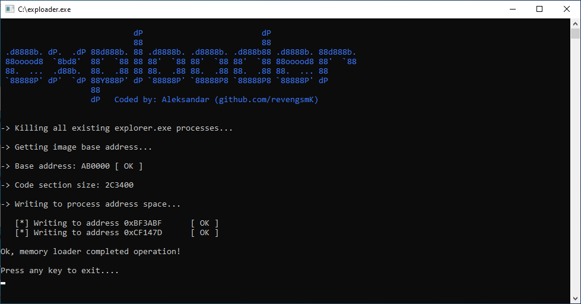

## exploader

Windows 10 (32-bit) temporary 'Activate Windows' watermark remover. Reverse engineering PoC code.

### Screenshot & demo

 


https://user-images.githubusercontent.com/95986479/159374398-868af56a-aa9d-477d-9c5e-b46665c16f13.mp4


### Overview

Unactivated Windows 10 displays 'Activate Windows' watermark in a lower right corner of your screen approx. 3 hours after system startup.   

This memory loader approach will kill Windows shell (_explorer.exe_), and then launch modified version with the watermark removed. Watermark stays hidden until you restart system or Windows shell.

Although this is a temporary solution (just a PoC code), it can still be useful if you want to make screenshots, record screen, play fullscreen games etc. with watermark removed.

### Usage

Run **exploader.exe**. 

### How to build

Install either GCC or MSVC compiler and set PATH environment variable correctly to point to your chosen compiler, then run **build.bat** script. The script prefers GCC, but if it is not available it will try to build using MSVC.

This loader is intended to be compiled as a **32-bit** binary, so make sure you have set your compiler to output **32-bit** image.

### Tested versions

1. Windows 10 Pro (32-bit) 20H2
2. Windows 10 Pro (32-bit) 21H1
3. Windows 10 Pro (32-bit) 21H2


### Note on antivirus

Your antivirus software may flag this loader as a malware or potentially unwanted program (PUP).   
Please ignore this, and add it to your antivirus exclusion list.

### Support

[](bitcoin:bc1qjwedefp3xruv7qak72l89hzx5mx0c0ftq8qem7)

If you would like to see more projects like this one, please consider supporting me :)  

Donate bitcoin to the following address:


```
bc1qjwedefp3xruv7qak72l89hzx5mx0c0ftq8qem7
```
